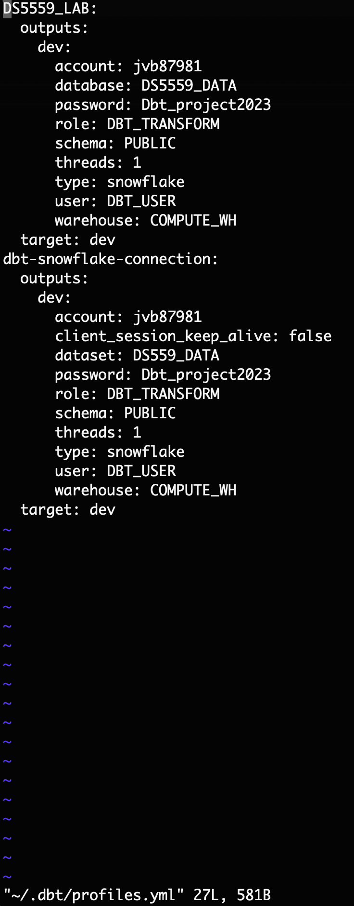
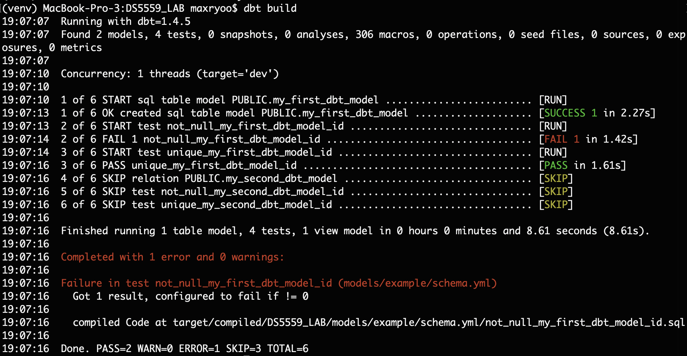

# DS5559_dbt_lab

This lab was done for the DS5559 Lab that utilizes dbt.

### Installing DBT at the command line

DBT was installed in a virtual env. The requirments.txt file utilized can be found at https://github.com/hyunsukr/DS5559_dbt_lab/blob/main/requirments.txt

### Set up connection to and test Snowflake

All databse configurations were done on snowflake. A couple of more roles were added as well.

You can find the dbt profiles in a picture below. 

###  Final configuration in dbt_project.yml

The final configuration can be found here: https://github.com/hyunsukr/DS5559_dbt_lab/blob/main/DS5559_LAB/dbt_project.yml

### Final Run

